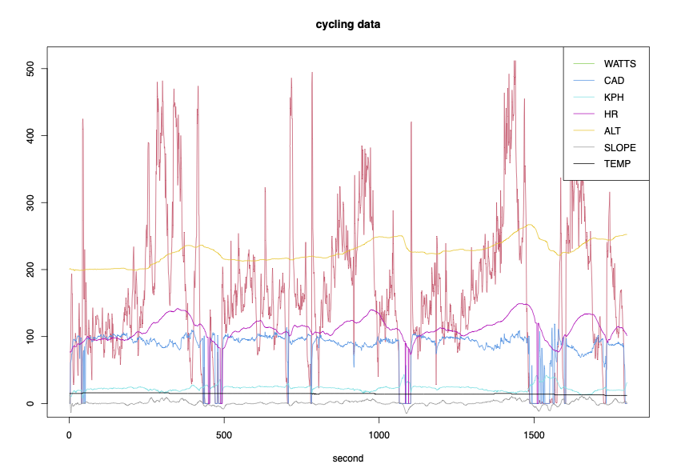

# Functional-Data

## Regression with functional covariates

### Functional output and functional covariates

1. FFR, PenFFR: code available <a href="https://github.com/Orange-OpenSource/penffr">here</a> 

Corresponding paper: 
J.S. Tamo Tchomgui, J. Jacques, V. Barriac, G. Fraysse, S. Chrétien (2023). A Penalized Spline Estimator for Functional Linear Regression with Functional Response.  <a href="https://hal.science/hal-04120709">HAL</a>

2. FFMoE / PenFFMoE,a mixture approach : code available <a href="https://github.com/Orange-OpenSource/penffr">here</a>  

Corresponding paper: 
J.S. Tamo Tchomgui, J. Jacques, V. Barriac, G. Fraysse, S. Chrétien (2024). A mixture of experts regression model for functional response with functional covariates. To appear in Statistics and Computing  <a href="https://hal.science/hal-04529923">HAL</a>

### Continuous, ordinal or nominal categorical output and functional covariates

1. FREG : R package for linear, ordinal and logistic regression with functional covariates

Corresponding paper for the ordinal case: 
J. Jacques, S. Samardzic (2022). Analyzing cycling sensors data through ordinal logistic regression with functional covariates. Journal of the Royal Statistical Society, Series C, 71[4], 969-986. <a href="https://hal.archives-ouvertes.fr/hal-03107427">HAL</a>

## Functional data clustering

1. FunHDDC : R package for clustering functional data

Corresponding papers: 
A. Schmutz, J. Jacques, C. Bouveyron, L. Chèze and P. Martin (2020). Clustering multivariate functional data in group-specific functional subspaces, Computational Statistics, 35, 1101-1131. <a href="https://hal.inria.fr/hal-01652467">HAL</a>

C.Bouveyron and J.Jacques (2011), Model-based Clustering of Time Series in Group-specific Functional Subspaces, Advances in Data Analysis and Classification, 5[4], 281-300.

2. FunFEM : R package for co-clustering functional data, available on <a href="https://cran.r-project.org/web/packages/funFEM/">CRAN</a>

Corresponding papers: 
C. Bouveyron, E. Côme and J. Jacques (2015), The discriminative functional mixture model for the analysis of bike sharing systems, Annals of Applied Statistics, 9[4], 1726-1760. <a href="http://hal.archives-ouvertes.fr/hal-01024186/fr/">HAL</a>

## Functional data co-clustering

1. FunLBM : R package for co-clustering functional data, available on <a href="https://cran.r-project.org/web/packages/funLBM/">CRAN</a>

Corresponding papers: 
C. Bouveyron, L. Bozzi L., J. Jacques J. and F-X. Jollois (2018). The Functional Latent Block Model for the Co-Clustering of Electricity Consumption Curves, Journal of the Royal Statistical Society, Series C, 67 [4], 897-915. <a href="https://hal.inria.fr/hal-01533438">HAL</a>

## Multivariate functional data set

1. The [cycling](cycling.Rdata) data set provides 216 observations of 9 curves. Each curve is sampled at 1800 regular time points. To use it, please tell me and cite: 

J. Jacques, S. Samardzic (2022). Analyzing cycling sensors data through ordinal logistic regression with functional covariates. Journal of the Royal Statistical Society, Series C, 71[4], 969-986.

Publications using this data set: 
S. Weinberger , J. Cugliari , A. Le Cain (2025). Ordinal regression for preference learning in wearables using sensor data. Expert Systems with Applications, In press, https://hal.science/hal-05038326v1

